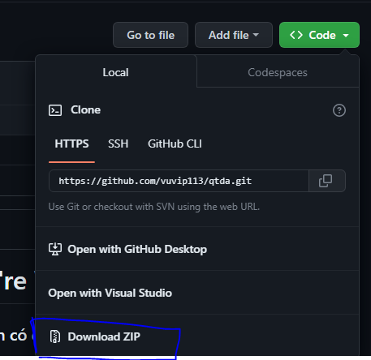
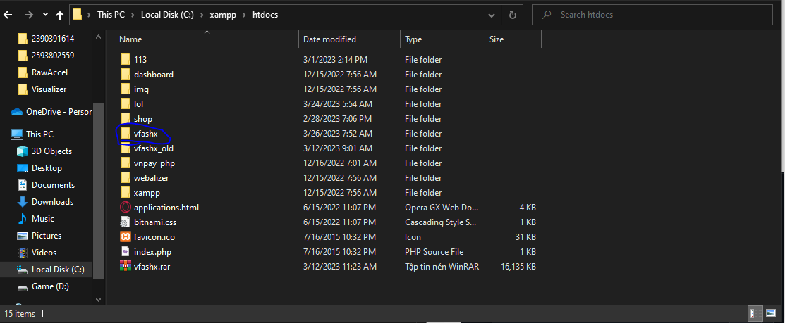
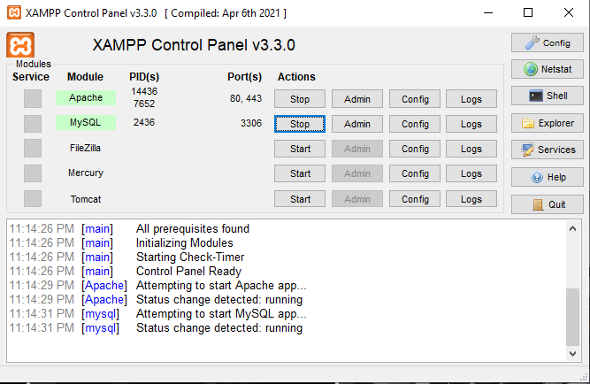
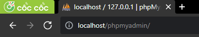
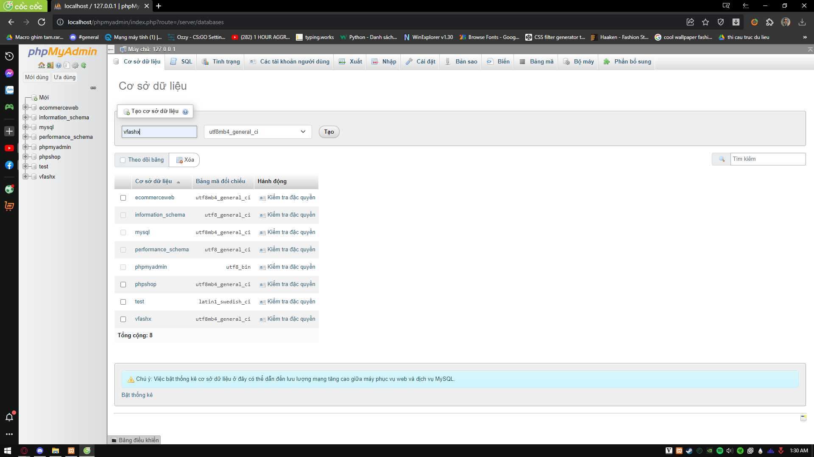
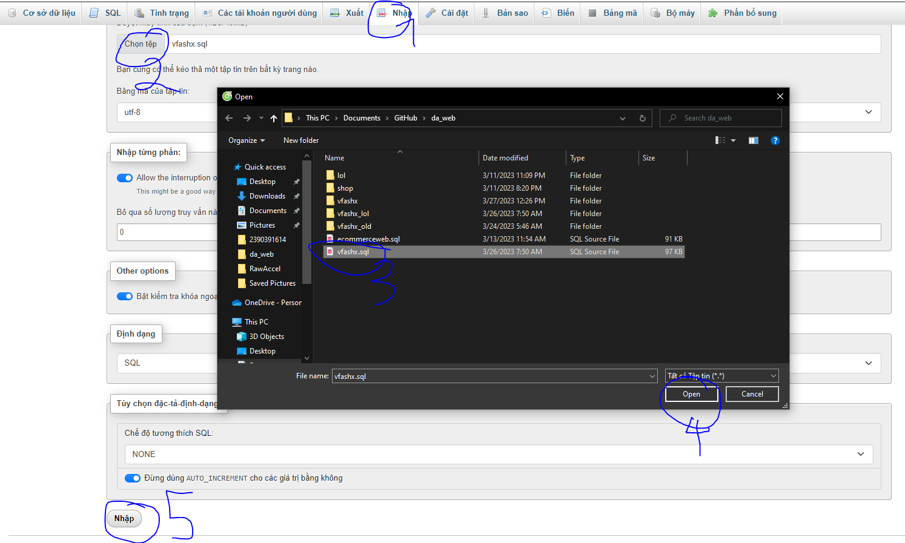
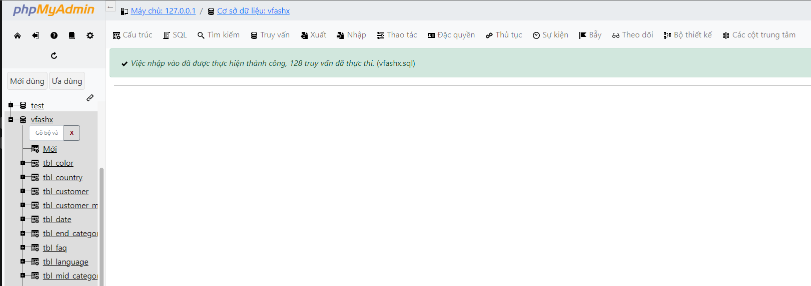

<h1 align="center">Hi 💓, We're Vfashx</h1>
<h3 align="center">Làm 1 web site đơn giản có đầy đủ chức năng</h3>

<p align="left">  </p>
<p align="left"> <a href="https://twitter.com/" target="blank"></a> </p>
- 🔭 We're currently working on [Github](https://github.com/vuvip113/qtda)

- 🌱 We're currently learning **PHP WEB**

- 💬 Ask me about **PHP CODE, ANIMATION**

- 📫 How to contact me **vucute775@gmail.com**


## Yêu cầu mồi trường

Để chạy dự án này, bạn cần thêm các biến môi trường sau của mình

Cài đặt và sử dụng `XXAMPP` [👉](https://choosealicense.com/licenses/mit/)

Biết sử dụng ngôn ngử để tạo web css, php, js,...

#DEMO
 https://vfashx.click

# Cách chạy chương trình 

▶️ Dowload 2 file trên về r giải nén ra
 + vfashx (folder)
 + vfashx.sql



▶️ Copy file vfashx paste vào địa chỉ sau `C:\xampp\htdocs`


▶️ Mở Xampp click Start 2 cái 
+ Start `Apache`
+ Start `MySQL`



▶️ Mở Mạng web (Cốc Cốc, Chorme, ...)
- Sử dụng dụng câu lệnh 
```bash
  http://localhost/phpmyadmin/
```

- Tạo 1 database ten la `vfashx` 


- Vào database `vfashx` Chọn Nhập -> Chọn Tệp -> sử dụng tệp `vfashx.sql` mà đã tải về -> Open -> Nhập


-> Thành công sẽ hiện ra bảng nhập thành công nếu lỗi thì kiểm tra lại các bước trên 


▶️ Mở tab web mới (Cốc Cốc, Chorme, ...)
- Sử dụng dụng câu lệnh 
```bash
  http://localhost/vfashx/
```


<h1 align="center">Chúc Các Bạn Thành Công 👋👋👋</h1>
